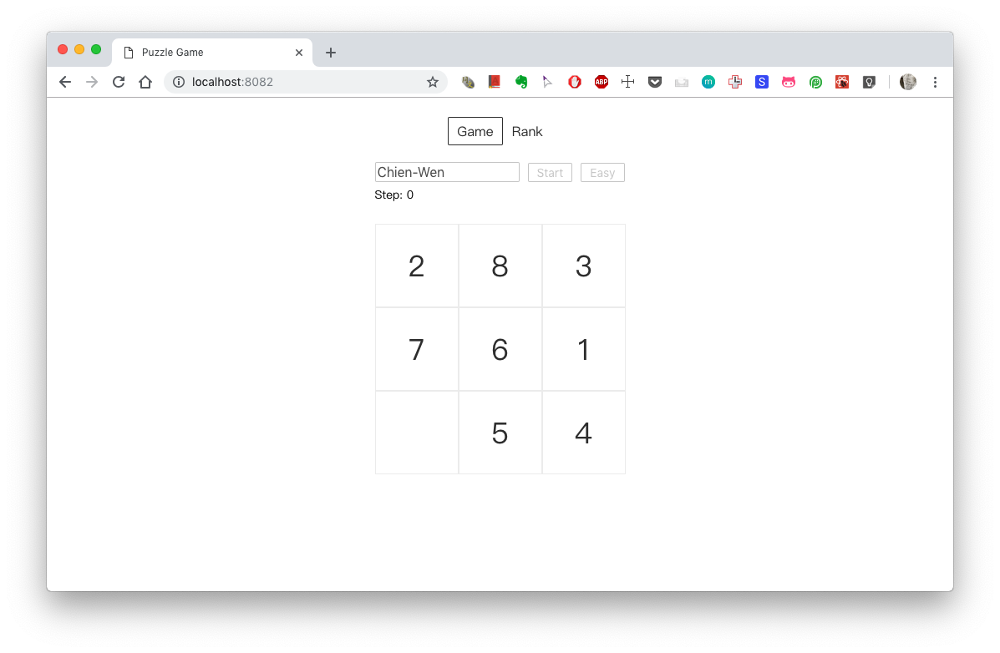
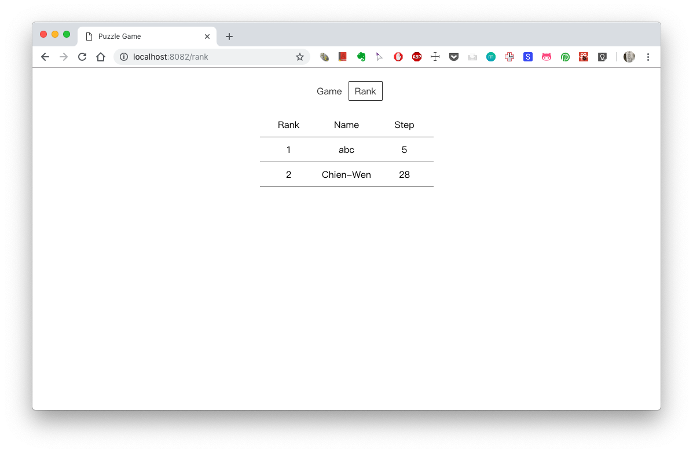

### A sliding puzzle game with react and react router

 

This is a challenge hosted by a training program I currently join.  
A sliding puzzle game web app must be created within 8 hours by using react, react-router without sacrifice code quality. 

Demo: https://puzzle-9788e.firebaseapp.com/
 
Code: https://github.com/skyying/sliding-puzzle-game/tree/master/src
 

#### Play sliding puzzle game, record steps as ranking score

#### Save game record and show player rank

